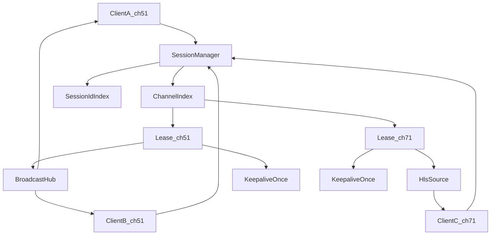
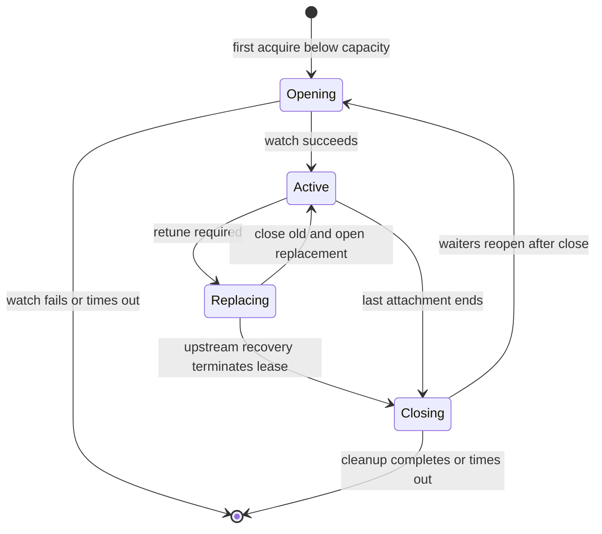

# Tuner Session Sharing Design

## Problem

The proxy previously guarded concurrent playback by counting HTTP response streams (`activeStreams` in 4th gen) or by
probing `/server/tuners` (legacy) before each watch. That did not match Tablo's resource model: each `POST .../watch`
creates a player session that consumes a tuner. Two clients on the same channel got two Tablo sessions and consumed two
tuners.

## Goals

1. Track tuner usage by distinct Tablo player session IDs (tokens), not by HTTP stream count.
2. Fail starting a new Tablo session when the number of active sessions would exceed available tuners.
3. When multiple clients tune to the same channel, attach them to one shared upstream through a broadcast source so one
   Tablo session serves all clients.
4. Keep keepalive, expiry retune, playlist-change restart, and player-session DELETE semantics once per lease, not per
   client.
5. Reserve capacity while a watch request is in flight so concurrent requests cannot oversubscribe tuners.
6. Prevent a stalled HTTP client from backpressuring every client attached to the same channel.

## Non-goals

- Changing HLS segment polling or MPEG-TS health logic in
  [HlsBackend.scala](../src/main/scala/app/stream/HlsBackend.scala).
- Changing Tablo authentication or HMAC handling.
- Adding soft limits, fairness, or queueing across different channels. New channels fail when capacity is exhausted.

## Architecture status

Implemented. 4th gen and legacy channel routes acquire through a shared `SessionManager`. Legacy no longer pre-checks
`in_use` tuners per request; capacity comes from `/server/tuners`.length (or 4th gen `/server/info` model.tuners).

## Concepts

| Term | Meaning |
|------|---------|
| `ChannelKey` | Stable channel ID (`String` for 4th gen, `Long` for legacy) |
| `TunerLease` | One Tablo watch/player session with token and playlist metadata |
| `SessionId` | Current Tablo player token; legacy uses its watch-response token |
| `AttachmentId` | Proxy-generated UUID for one HTTP response consumer |
| Client attachment | One HTTP `GET /channel/{id}` consumer |
| Capacity reservation | One `Opening`, `Active`, `Replacing`, or `Closing` channel entry |
| Capacity | `capacity reservations <= totalTuners` (zero tuners rejects all new opens) |
| Same channel | Reuse the lease and attach to its `BroadcastHub` |
| Different channel | Create a lease if capacity is available |



## Session manager

`SessionManager` is a typed actor spawned beside `LineupActor` in
[Tablo2HDHomeRun.scala](../src/main/scala/app/Tablo2HDHomeRun.scala).

### External API

```scala
sealed trait ChannelKey
case class Gen4Channel(id: String) extends ChannelKey
case class LegacyChannel(id: Long) extends ChannelKey

case class Acquire(channel: ChannelKey, replyTo: ActorRef[AcquireResult])

sealed trait AcquireResult
case class Attached(
  attachmentId: UUID
, source: Source[ByteString, NotUsed]
) extends AcquireResult
case object NoAvailableTuners extends AcquireResult
case class AcquireFailed(cause: Throwable) extends AcquireResult
```

The manager wraps each returned source so materialization and termination report through a single
`AttachmentSignal(attachmentId, event)` (`AttachmentStarted`, `AttachmentEnded`, or
`AttachmentMaterializeTimedOut`). Signals are idempotent. Routes do not manually release sessions.

Open, close, and replace async steps run as Pekko Stream flows (`ProtocolFlows`) with
`completionTimeout`; the actor receives terminal results (`OpenFinished`, `CloseFinished`,
`ReplaceCloseFinished`, `ReplaceOpenFinished`, or `ReplaceLateClose` for a timed-out close step)
rather than intermediate `pipeToSelf` phase messages. Capacity, channel index,
and session-id index remain actor-owned.

### State

```scala
Map[ChannelKey, SessionEntry]
Map[SessionId, ChannelKey]

sealed trait SessionEntry
case class Opening(reservationId: UUID, waiters: Vector[PendingAcquire]) extends SessionEntry
case class Active(state: SessionRuntimeState) extends SessionEntry
case class Replacing(
  state: SessionRuntimeState
, priorSessionId: SessionId
, phase: ReplacePhase
, replyTo: Option[ActorRef[ReplaceResult]]
, attemptId: UUID
) extends SessionEntry
case class Closing(sessionId: String, waiters: Vector[PendingAcquire]) extends SessionEntry
```

`Opening`, `Active`, `Replacing`, and `Closing` each consume exactly one local tuner reservation. The session-ID index
contains active Tablo tokens only. A replacement keeps the channel reservation while removing the old token and adding
the new token. `phase` indicates the progress of a close or open step in flight (`ClosingPrior`, `OpeningNext`, `WaitingForLateClose`, `ReadyToRetryOpen`). `Closing.waiters` holds acquires that arrived during
teardown and are reopened after close when capacity allows.



### Acquire behavior

1. For an `Active` or `Replacing` channel, create an attachment grant and return a wrapped hub source immediately.
2. For an `Opening` channel, append the request to its waiters without issuing another Tablo watch.
3. For a `Closing` channel, queue the request and reopen after close completes when capacity allows.
4. For a missing channel at capacity (including zero tuners), return `NoAvailableTuners` without calling Tablo.
5. For a missing channel below capacity, synchronously insert `Opening`, then start the asynchronous Tablo watch via
   the stream-backed open flow.
6. On open success, create one runtime, index its session ID, transition to `Active`, and reply to all waiters.
7. On open failure, remove the reservation and fail all waiters. Map Tablo HTTP 503 to `NoAvailableTuners`.

Startup gates acquires until the first tuner refresh completes or `startupRefreshTimeout` elapses (fallback to the
backend's last known total).

### Attachment lifecycle

- Start a materialization deadline when an attachment is granted.
- `AttachmentSignal(..., AttachmentStarted)` cancels that deadline.
- `AttachmentSignal(..., AttachmentEnded(...))`, including failure, removes the attachment.
- Remove a grant that does not materialize before the deadline and shut down its kill switch.
- When no pending or materialized attachments remain, transition to `Closing`, stop the stream, cancel keepalive, and
  close the Tablo session via the stream-backed close flow.
- Keep `Closing` reserved until close completes or its bounded timeout expires, then remove it.
- Log close failures and let a later Tablo HTTP 503 remain authoritative.
- Treat duplicate, late, and out-of-order lifecycle signals as harmless.

### Session replacement

- A playlist URL change under the same token restarts only the HLS upstream.
- A true retune transitions `Active` to `Replacing` without releasing its capacity reservation.
- Retain the old token in the session-ID index until its DELETE succeeds (or until a late close arrives after a close-step
  timeout); do not open a replacement while close is still outstanding.
- Issue the replacement watch only after the close step finishes.
- Replace progresses through phases: `ClosingPrior` → `OpeningNext` → `Active`, with `WaitingForLateClose` after a
  close-step timeout and `ReadyToRetryOpen` after an open-step failure/timeout. Close and open steps each run as a
  separate stream (`closeStep` / `openStep`) with `replaceTimeout`; the actor handles one terminal
  `ReplaceCloseFinished` or `ReplaceOpenFinished` per step, and `ReplaceLateClose` when a close-step timeout fires
  before Tablo DELETE completes.
- Each close or open step is bounded by `replaceTimeout`. `SharedChannelStream` waits
  `replaceTimeout * 2 + replaceTimeout / 5` so a full close-then-open cycle can finish with headroom before the
  stream-side timeout abandons the reply.
- On replacement success, add the new token to the index and return to `Active`.
- A transient open failure (or open-step timeout) moves to `ReadyToRetryOpen`, keeps the reservation, and lets
  `ResilientHlsSource` retry open without re-closing the already deleted prior session. A close-step timeout rejects
  retries with `ReplaceAlreadyInProgress` until the late DELETE completes. A failed DELETE returns to `Active` so the
  next replace retries close before opening.
- On replace failure, `SharedChannelStream` resumes keepalive only when the prior session is still live (for example a
  failed DELETE that returns to `Active`). Keepalive stays paused for `ReplaceTimedOut`, `ReplaceAlreadyInProgress`,
  and `ReplaceOpenFailed` so tokens are not rotated against a deleted or still-closing prior. A late close failure that
  restores `Active` calls `resumeKeepalive` on the runtime.
- `SharedChannelStream` owns a single replace attempt at a time via an atomic generation + promise owner. Overlapping
  replace starts are rejected with `ReplaceAlreadyInProgress` without orphaning the active promise. Abort on
  stop/terminate fails that promise, clears ownership, and stops the reply adapter. Replace sets `replaceInProgress`
  before attempt ownership. Keepalive snapshots the generation before checking that flag and revalidates flag plus
  generation immediately before starting the request, so a concurrent replace cannot bind keepalive to the new
  generation.
- Keepalive/fetch completions are generation-gated. When a completion is still current but the session id has rotated,
  the stream schedules a keepalive retry instead of going idle. Keepalive failure waits for fetch to settle before
  scheduling the next retry or normal keepalive. Late success replies are ignored so `currentSession` is not mutated
  after abandonment.
- Keepalive/fetch token or playlist URL changes notify `SessionManager` / restart HLS so the session-ID index and
  upstream stay aligned.
- If recovery reaches its terminal timeout, terminate the shared stream, fail in-flight replace waiters, and clean up.

### Settings

Injected `SessionManager.Settings` defaults:

- Session open timeout: 10 seconds.
- Route ask timeout: 15 seconds.
- Granted-source materialization timeout: 5 seconds.
- Player-session close timeout: 5 seconds.
- Per-subscriber backpressure timeout: 30 seconds.
- Replace timeout: 10 seconds per close or open step (`SharedChannelStream` reply budget is `2.2 × replaceTimeout`).
- Startup tuner refresh timeout: 10 seconds.

Tests pass shorter settings so they complete deterministically without real-time waits.

### Tuner capacity

For 4th gen, load `/server/info` `model.tuners` and cache it with a fallback of four tuners. Refresh the count at
startup and after capacity-related failures. A reduced count blocks new reservations but does not terminate existing
sessions. A refresh of zero rejects further opens.

Tablo watch HTTP 503 remains authoritative when recordings or clients outside the proxy consume tuners unknown to the
session manager.

For legacy, load capacity from `/server/tuners`.length at startup or refresh time (success responses only). Do not gate
each watch request on the response's live `in_use` flags.

## Shared channel stream

`SharedChannelStream` owns the shared playback lifecycle:

- Maintain one session `AtomicReference`, one keepalive loop, and one `ResilientHlsSource` per tuner lease.
- Materialize into `BroadcastHub.sink[ByteString](startAfterNrOfConsumers = 1, bufferSize = 256)`.
- For each client, subscribe to the hub, apply `backpressureTimeout`, and report materialization and termination to
  `SessionManager`.
- Fail and detach a subscriber that exceeds the timeout so it cannot stall healthy subscribers indefinitely.
- Report upstream completion/failure and player-token changes to `SessionManager`.
- Pause keepalive during replace; ignore stale keepalive/fetch updates after a session id change.
- Legacy recovery (no keepalive ops) requests a close-first replacement watch on non-first HLS factory attempts.

Late subscribers receive future live bytes only. The shared stream does not replay previous MPEG-TS data.

## Route behavior

Capacity failures and Tablo watch HTTP 503 return proxy HTTP 503. Unexpected internal failures return HTTP 500. Missing
4th-gen session tokens fail the open path instead of inventing a UUID.

## Edge cases

1. Concurrent same-channel acquires create one `Opening`, one Tablo watch, and multiple attachments.
2. Concurrent different-channel acquires count `Opening` entries toward capacity.
3. A failed or timed-out open removes its reservation and completes all same-channel waiters.
4. A granted source that never materializes expires and closes an otherwise orphaned session.
5. A slow consumer fails and detaches after `backpressureTimeout`; hub buffer may briefly stall peers until then.
6. A terminal shared-upstream failure cleans up once and fails in-flight replace callers.
7. Retune closes the old session first, preserves one reservation, then opens and indexes the replacement.
8. Duplicate termination messages cannot double-close a session or produce a negative attachment count.
9. A late subscriber receives future live bytes without replay.
10. Acquires during `Replacing` attach immediately to the shared hub instead of waiting on replace completion.

## Operational logging

Session lifecycle uses the `[session]` prefix. Shared upstream events use `[shared]`. HTTP channel responses use
`[channel]`.

| Event | Level | Key fields |
|-------|-------|------------|
| Client granted / queued | info | `channel`, `sessionId`, `attachment`, `shared`, `clients` |
| Client connect (stream materialized) | info | `channel`, `sessionId`, `attachment`, `clients`, `shared` |
| Client disconnect (clean) | info | `channel`, `sessionId`, `attachment`, `clientsRemaining`, `shared` |
| Client stream failed | warn | same plus exception |
| Session open / active / close | info | `channel`, `sessionId`, `clients`, `reserved`, `total` |
| Capacity rejection / open failure / replace failure | warn | `channel`, reason/exception |

On disconnect, `shared=true` means the session had more than one client before this disconnect. `clientsRemaining`
is the post-disconnect count. On connect/grant, `shared=true` and `clients>1` mean multiple clients are currently
attached (including granted-but-not-yet-materialized attachments).

## Legacy support

Legacy Tablo uses the same `SessionManager` with `LegacyChannel`. The watch-response token is its `SessionId`. Legacy
has no keepalive or DELETE behavior, so teardown only stops the shared stream. HLS recovery requests a close-first
replacement watch through `SessionManager`. Legacy watch HTTP 503 maps to `NoAvailableTuners` (proxy HTTP 503).

## Key files

- `src/main/scala/app/tuner/SessionManager.scala`
- `src/main/scala/app/tuner/SharedChannelStream.scala`
- `src/main/scala/app/tuner/Tablo4thGen.scala`
- `src/main/scala/app/tuner/TabloLegacy.scala`
- `src/main/scala/app/Tablo2HDHomeRun.scala`
- `src/test/scala/app/tuner/SessionManagerSpec.scala`
- `src/test/scala/app/tuner/SharedChannelStreamSpec.scala`
- `Dockerfile.jvm`
- `docs/ARCHITECTURE.md`
- `docs/USAGE.md`
