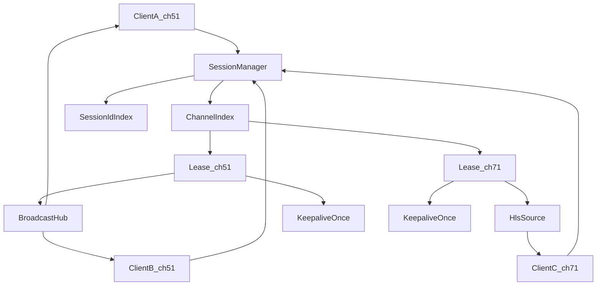
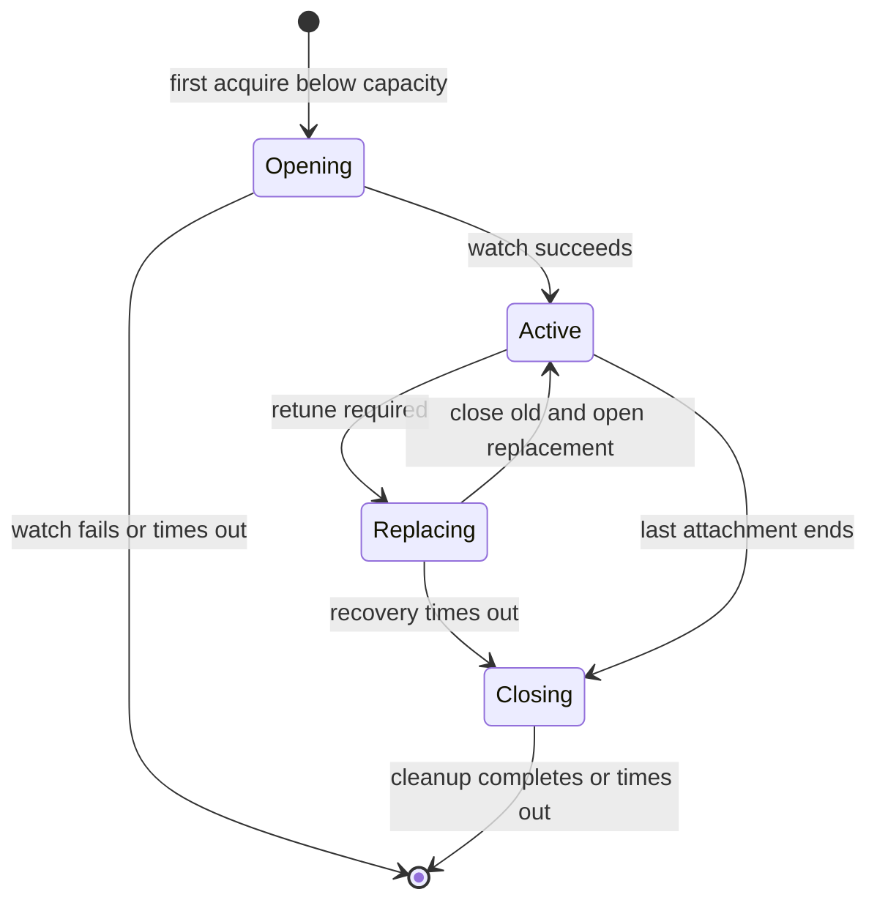

# Tuner Session Sharing Design

## Problem

Today the proxy guards concurrent playback by counting HTTP response streams (`activeStreams` in 4th gen) or by probing
`/server/tuners` (legacy) before each watch. That does not match Tablo's real resource model: each `POST .../watch`
creates a player session that consumes a tuner. Two clients on the same channel get two Tablo sessions and consume two
tuners.

## Goals

1. Track tuner usage by distinct Tablo player session IDs (tokens), not by HTTP stream count.
2. Fail starting a new Tablo session when the number of active sessions would exceed available tuners.
3. When multiple clients tune to the same channel, attach them to one shared upstream through a broadcast source so one
   Tablo session serves all clients.
4. Keep keepalive, expiry retune, playlist-change restart, and player-session DELETE semantics once per lease, not per
   client.
5. Reserve capacity while a watch request is in flight so concurrent requests cannot oversubscribe tuners.
6. Prevent a stalled HTTP client from backpressuring every client attached to the same channel.

## Non-goals

- Changing HLS segment polling or MPEG-TS health logic in
  [HlsBackend.scala](../src/main/scala/app/stream/HlsBackend.scala).
- Changing Tablo authentication or HMAC handling.
- Adding soft limits, fairness, or queueing across different channels. New channels fail when capacity is exhausted.

## Current code to replace

- Fourth gen:
  [Tablo4thGen.scala](../src/main/scala/app/tuner/Tablo4thGen.scala). Remove `activeStreams` and `tunerCheckFuture`;
  move `streamWithTunerTracking` out of the per-request route.
- Legacy:
  [TabloLegacy.scala](../src/main/scala/app/tuner/TabloLegacy.scala). Replace the `GET /server/tuners` pre-check with
  the session reservation limit.

## Concepts

| Term | Meaning |
|------|---------|
| `ChannelKey` | Stable channel ID (`String` for 4th gen, `Long` for legacy) |
| `TunerLease` | One Tablo watch/player session with token and playlist metadata |
| `SessionId` | Current Tablo player token; legacy uses its watch-response token |
| `AttachmentId` | Proxy-generated UUID for one HTTP response consumer |
| Client attachment | One HTTP `GET /channel/{id}` consumer |
| Capacity reservation | One `Opening`, `Active`, `Replacing`, or `Closing` channel entry |
| Capacity | `capacity reservations <= totalTuners` |
| Same channel | Reuse the lease and attach to its `BroadcastHub` |
| Different channel | Create a lease if capacity is available |



## Session manager

Implement `SessionManager` as a typed actor spawned beside `LineupActor` in
[Tablo2HDHomeRun.scala](../src/main/scala/app/Tablo2HDHomeRun.scala).

### External API

The final types may vary, but the external behavior should match this API:

```scala
sealed trait ChannelKey
case class Gen4Channel(id: String) extends ChannelKey
case class LegacyChannel(id: Long) extends ChannelKey

case class Acquire(channel: ChannelKey, replyTo: ActorRef[AcquireResult])

sealed trait AcquireResult
case class Attached(
  attachmentId: UUID
, source: Source[ByteString, NotUsed]
) extends AcquireResult
case object NoAvailableTuners extends AcquireResult
case class AcquireFailed(cause: Throwable) extends AcquireResult
```

The manager wraps each returned source so materialization sends `AttachmentStarted(attachmentId)` and termination sends
`AttachmentEnded(attachmentId)`. Both messages are idempotent. Routes do not manually release sessions.

### State

```scala
Map[ChannelKey, SessionEntry]
Map[SessionId, ChannelKey]

sealed trait SessionEntry
case class Opening(reservationId: UUID, waiters: Vector[PendingAcquire]) extends SessionEntry
case class Active(runtime: SessionRuntime, attachments: Map[UUID, AttachmentState]) extends SessionEntry
case class Replacing(runtime: SessionRuntime, attachments: Map[UUID, AttachmentState]) extends SessionEntry
case class Closing(sessionId: String) extends SessionEntry
```

`Opening`, `Active`, `Replacing`, and `Closing` each consume exactly one local tuner reservation. The session-ID index
contains active Tablo tokens only. A replacement keeps the channel reservation while removing the old token and adding
the new token.



### Acquire behavior

1. For an `Active` channel, create an attachment grant and return a wrapped copy of its hub source.
2. For an `Opening` channel, append the request to its waiters without issuing another Tablo watch.
3. For a `Replacing` channel, queue the request until replacement succeeds or recovery fails.
4. For a missing channel at capacity, return `NoAvailableTuners` without calling Tablo.
5. For a missing channel below capacity, synchronously insert `Opening`, then start the asynchronous Tablo watch with
   `pipeToSelf`.
6. On open success, create one runtime, index its session ID, transition to `Active`, and reply to all waiters.
7. On open failure, remove the reservation and fail all waiters. Map Tablo HTTP 503 to `NoAvailableTuners`.

The reservation must be inserted before starting the future. This prevents concurrent different-channel requests from
passing the capacity check while earlier opens are unresolved.

### Attachment lifecycle

- Start a materialization deadline when an attachment is granted.
- `AttachmentStarted` cancels that deadline.
- `AttachmentEnded`, including failure, removes the attachment.
- Remove a grant that does not materialize before the deadline.
- When no pending or materialized attachments remain, transition to `Closing`, stop the stream, cancel keepalive, and
  close the Tablo session.
- Keep `Closing` reserved until close completes or its bounded timeout expires, then remove it.
- Log close failures and let a later Tablo HTTP 503 remain authoritative.
- Treat duplicate, late, and out-of-order lifecycle messages as harmless.

### Session replacement

- A playlist URL change under the same token restarts only the HLS upstream.
- A true retune transitions `Active` to `Replacing` without releasing its capacity reservation.
- Retain the old token in the session-ID index until its DELETE succeeds or reaches a bounded timeout, then remove it.
- Issue the replacement watch only after the close step finishes.
- On replacement success, add the new token to the index and return to `Active`.
- A transient replacement failure keeps the `Replacing` reservation while `ResilientHlsSource` retries.
- If recovery reaches its terminal timeout, terminate the shared stream, fail queued acquires, and clean up the entry.

All true replacement requests go through `SessionManager`, which owns close-before-open ordering and the session-ID
index. `SharedChannelStream` requests replacement and receives the resulting session asynchronously.

### Settings

Expose these fixed defaults as injected `SessionManager.Settings` values rather than new environment variables:

- Session open timeout: 10 seconds.
- Route ask timeout: 15 seconds.
- Granted-source materialization timeout: 5 seconds.
- Player-session close timeout: 5 seconds.
- Per-subscriber backpressure timeout: 30 seconds.

Tests pass shorter settings so they complete deterministically without real-time waits.

### Tuner capacity

For 4th gen, load `/server/info` `model.tuners` and cache it with a fallback of four tuners. Refresh the count at
startup and after capacity-related failures. A reduced count blocks new reservations but does not terminate existing
sessions.

Tablo watch HTTP 503 remains authoritative when recordings or clients outside the proxy consume tuners unknown to the
session manager.

For legacy, load capacity from `/server/tuners`.length at startup or refresh time. Do not gate each watch request on the
response's live `in_use` flags.

## Shared channel stream

Extract the shared playback lifecycle from `streamWithTunerTracking` into `SharedChannelStream`:

- Maintain one session `AtomicReference`, one keepalive loop, and one `ResilientHlsSource` per tuner lease.
- Materialize into `BroadcastHub.sink[ByteString](startAfterNrOfConsumers = 1, bufferSize = 256)`.
- Keep the buffer size a power of two as required by Pekko.
- For each client, subscribe to the hub, apply `backpressureTimeout`, and report materialization and termination to
  `SessionManager`.
- Do not use a dropping overflow strategy for MPEG-TS bytes.
- Fail and detach a subscriber that exceeds the timeout so it cannot stall healthy subscribers.
- Report upstream completion, upstream failure, and player-token changes to `SessionManager`.
- Keep cleanup manager-owned and idempotent.

Late subscribers receive future live bytes only. The shared stream does not replay previous MPEG-TS data.

## 4th gen route

The channel route delegates acquisition to `SessionManager` and streams the returned source:

```scala
onComplete(sessionManager.ask(Acquire(Gen4Channel(channelId), _))) {
  case Success(Attached(_, source)) =>
    complete(Chunked.fromData(videoMp2t, source))
  case Success(NoAvailableTuners) =>
    complete(StatusCodes.ServiceUnavailable -> "No available tuners")
  case Failure(_) | Success(AcquireFailed(_)) =>
    complete(StatusCodes.InternalServerError)
}
```

Capacity failures and Tablo watch HTTP 503 always return proxy HTTP 503. Unexpected internal failures return HTTP 500.

## Edge cases

1. Concurrent same-channel acquires create one `Opening`, one Tablo watch, and multiple attachments.
2. Concurrent different-channel acquires count `Opening` entries toward capacity.
3. A failed or timed-out open removes its reservation and completes all same-channel waiters.
4. A granted source that never materializes expires and closes an otherwise orphaned session.
5. A slow consumer fails and detaches without dropping MPEG-TS chunks or stalling healthy consumers.
6. A terminal shared-upstream failure cleans up once and fails all attached clients.
7. Retune closes the old session first, preserves one reservation, then opens and indexes the replacement.
8. Duplicate termination messages cannot double-close a session or produce a negative attachment count.
9. A late subscriber receives future live bytes without replay.

## Operational logging

Session lifecycle uses the `[session]` prefix. Shared upstream events use `[shared]`. HTTP channel responses use
`[channel]`.

| Event | Level | Key fields |
|-------|-------|------------|
| Client granted / queued | info | `channel`, `sessionId`, `attachment`, `shared`, `clients` |
| Client connect (stream materialized) | info | `channel`, `sessionId`, `attachment`, `clients`, `shared` |
| Client disconnect (clean) | info | `channel`, `sessionId`, `attachment`, `clientsRemaining`, `shared` |
| Client stream failed | warn | same plus exception |
| Session open / active / close | info | `channel`, `sessionId`, `clients`, `reserved`, `total` |
| Capacity rejection / open failure / replace failure | warn | `channel`, reason/exception |

`shared=true` and `clients>1` indicate more than one HTTP client on the same Tablo player session.

## Legacy support

Deliver legacy support as milestone two of the same implementation. Use the same manager with `LegacyChannel`. The
legacy watch-response token is its `SessionId`. The current legacy implementation has no keepalive or DELETE behavior,
so teardown only stops the shared stream.

## Expected files

New files:

- `src/main/scala/app/tuner/SessionManager.scala`
- `src/main/scala/app/tuner/SharedChannelStream.scala`
- `src/test/scala/app/tuner/SessionManagerSpec.scala`
- `src/test/scala/app/tuner/SharedChannelStreamSpec.scala`

Files expected to change:

- `src/main/scala/app/tuner/Tablo4thGen.scala`
- `src/main/scala/app/tuner/TabloLegacy.scala`
- `src/main/scala/app/Tablo2HDHomeRun.scala`
- `Dockerfile.jvm`
- `README.md`
- `docs/ARCHITECTURE.md`
- `docs/USAGE.md`
